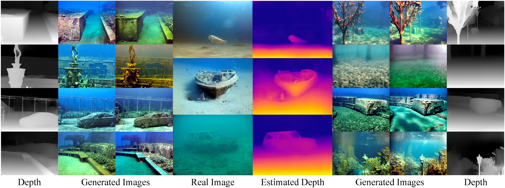
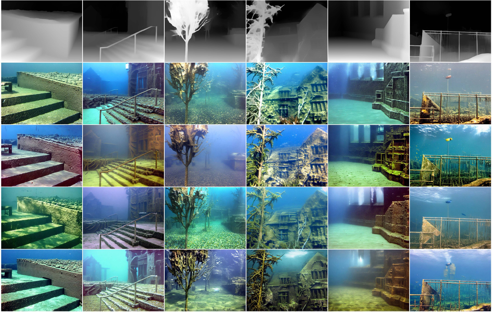

# Atlantis: Enabling Underwater Depth Estimation with Stable Diffusion 

> [**Atlantis: Enabling Underwater Depth Estimation with Stable Diffusion**]()  
> Fan Zhang, Shaodi You, Yu Li, Ying Fu  
> CVPR 2024, **Highlight**



This repository contains the official implementation and dataset of the CVPR2024 paper "Atlantis: Enabling Underwater Depth Estimation with Stable Diffusion", by Fan Zhang, Shaodi You, Yu Li, Ying Fu.

[Paper](https://arxiv.org/pdf/2312.12471.pdf) | [Supp](https://drive.google.com/file/d/1mNkiC5XyrcdPeLUt32-E94EYnH4IUrrW/view?usp=sharing) | [Data]()

> Monocular depth estimation has experienced significant progress on terrestrial images in recent years, largely due to deep learning advancements. However, it remains inadequate for underwater scenes, primarily because of data scarcity. Given the inherent challenges of light attenuation and backscattering in water, acquiring clear underwater images or precise depth information is notably difficult and costly. Consequently, learning-based approaches often rely on synthetic data or turn to unsupervised or self-supervised methods to mitigate this lack of data. Nonetheless, the performance of these methods is often constrained by the domain gap and looser constraints. In this paper, we propose a novel pipeline for generating photorealistic underwater images using accurate terrestrial depth data. This approach facilitates the training of supervised models for underwater depth estimation, effectively reducing the performance disparity between terrestrial and underwater environments. Contrary to prior synthetic datasets that merely apply style transfer to terrestrial images without altering the scene content, our approach uniquely creates vibrant, non-existent underwater scenes by leveraging terrestrial depth data through the innovative Stable Diffusion model. Specifically, we introduce a unique Depth2Underwater ControlNet, trained on specially prepared \{Underwater, Depth, Text\} data triplets, for this generation task. Our newly developed dataset enables terrestrial depth estimation models to achieve considerable improvements, both quantitatively and qualitatively, on unseen underwater images, surpassing their terrestrial pre-trained counterparts. Moreover, the enhanced depth accuracy for underwater scenes also aids underwater image restoration techniques that rely on depth maps, further demonstrating our dataset's utility.


## Update
- [ ] Data Release.
- **2024.04.04:** Code Release.
- **2024.02.27:** Accepted by CVPR 2024 as **Highlight**!
- **2023.12.18:** Repo created.

## Requirements
- Python 3.10.8
- PyTorch 1.13.0
- cudatoolkit 11.7


## Usage


### Step 1. Prepare `{Underwater, Depth, Text}` triplets
To train the `Depth2Underwater` ControlNet using `diffusers`, we first organize the data triplets into the following structure:
```
<triplets>
    |--Underwater
    |   |--0000.png
    |   |--0001.png
    |   |--...
    |
    |--Depth
    |   |--0000.png
    |   |--0001.png
    |   |--...
    |
    |--metadata.jsonl
    |--<triplets>.py
```
The `metadata.jsonl` file contains the text description, the filenames to each underwater image and depth as follows:
```
{"text": "some/text/descriptions", "image": "xxxx.jpg", "conditioning_image": "xxxx.jpg"}
```
and `<triplets>.py` is the script for loading the data named by `<triplets>` folder.

#### Underwater
Place your underwater images in the `underwater` folder, you can download the [UIEB](https://li-chongyi.github.io/proj_benchmark.html) dataset as we did. For more underwater datasets, refer to [Awesome Underwater Datasets](https://github.com/xahidbuffon/Awesome_Underwater_Datasets).

#### Depth
Clone the [MiDaS](https://github.com/isl-org/MiDaS) repo:
```
git clone https://github.com/isl-org/MiDaS.git
```
Install necessary dependencies by:
```
cd MiDaS
conda env create -f environment.yaml
```

Choose a preferred model type (e.g., [dpt_beit_large_512](https://github.com/isl-org/MiDaS/releases/download/v3_1/dpt_beit_large_512.pt)) and place the checkpoint into the `weights` folder:
```
cd weights
wget https://github.com/isl-org/MiDaS/releases/download/v3_1/dpt_beit_large_512.pt
```

Then you can predict depth with it by simply running:
```
cd ../
python run.py --model_type <model_type> --input_path /path/to/underwater/folder --output_path /path/to/depth/folder --grayscale
```
The ControlNet uses 8-bit grayscale depth for training so remember to modify the `bit` option of `write_depth` function in `run.py`. If you want to visualize depth into colored map, discard the `--grayscale` option and the color mapping used in the paper is `cv2.COLORMAP_PLASMA`.

#### Text
Install the [LAVIS](https://github.com/salesforce/LAVIS) library for image captioning:
```
pip install salesforce-lavis
```
Then you can generate text descriptions by running:
```
cd ../
python src/blip2_caption.py --input /path/to/underwater/folder --output /path/to/triplets/folder
```
the pretrained model will be downloaded and `metadata.jsonl` will be saved when all images are processed.

Finally, we modify the `triplets.py` script and point `METADATA_PATH`, `IMAGES_DIR`, `CONDITIONING_IMAGES_DIR` to corresponding directories. Place the script inside `<triplets>` folder and the dataset will be automatically formatted at the first loading during training.

### Step 2. Train `Depth2Underwater` ControlNet
`Diffusers` provides self-contained examples for training and deploying ControlNet and more details can be found [here](https://github.com/huggingface/diffusers/tree/main/examples/controlnet).

The training script requires the up-to-date install of `diffusers`, thus we install it from source as instructed:
```
git clone https://github.com/huggingface/diffusers
cd diffusers
pip install -e .
```
Then we install the requirements for the ControlNet example:
```
cd examples/controlnet
pip install -r requirements.txt
```


Now we can start training the ControlNet with the prepared `{Underwater, Depth, Text}` triplets. For example, to train the ControlNet with the `stable-diffusion-v1-5` model, run the following command with ~20 GB VRAM:
```
export MODEL_DIR="runwayml/stable-diffusion-v1-5"
export OUTPUT_DIR="./depth2underwater"

accelerate launch train_controlnet.py \
 --pretrained_model_name_or_path=$MODEL_DIR \
 --output_dir=$OUTPUT_DIR \
 --train_data_dir='/path/to/triplets/folder' \
 --resolution=512 \
 --learning_rate=1e-5 \
 --validation_image "/path/to/validation/image1" "/path/to/validation/image2"\
 --validation_prompt "some/preferred/prompts1" "some/preferred/prompts2"\
 --train_batch_size=2 \
 --gradient_accumulation_steps=4 \
 --max_train_steps 30000
```
Prepare unseen depths and preferred prompts (e.g., `an underwater view of coral reefs`) for validation, so we can tell if the model is trained correctly until we have observed the [sudden converge phenomenon](https://github.com/lllyasviel/ControlNet/blob/main/docs/train.md#more-consideration-sudden-converge-phenomenon-and-gradient-accumulation) (this tutorial and [discussion](https://github.com/lllyasviel/ControlNet/discussions/318#discussioncomment-7176692) are both beneficial). Keep training for more steps after that to ensure the model is well-trained.

If you have enough computing resources, try as large batch sizes as possible to get better results.

### Step 3. Generate `Atlantis` of your own
Now we can generate vivid, non-existent underwater scenes using the terrestrial depth and prompts.

1. Prepare a dataset containing terrestrial images and acquire depth maps using MiDaS as above. You can download the [DIODE](https://diode-dataset.org/) dataset as we did.

2. Modify directories and generate underwater scenes using the SD1.5 and `Depth2Underwater` ControlNet:
```
cd ../../
python inference.py --controlnet_path /path/to/depth2underwater/controlnet --depth_dir /path/to/terrestrial/depth --output_dir /path/to/output/folder
```
3. Finally, we generate an `Atlantis` of our own and can train depth models with it.




## Citation
If you find this repo useful, please give us a star and consider citing our papers:
```bibtex
@article{zhang2023atlantis,
  title={Atlantis: Enabling Underwater Depth Estimation with Stable Diffusion},
  author={Zhang, Fan and You, Shaodi and Li, Yu and Fu, Ying},
  journal={arXiv preprint arXiv:2312.12471},
  year={2023}
}
```

## Acknowledgement
Thanks for the great work of [MiDaS](https://github.com/isl-org/MiDaS), [Stable Diffusion](https://github.com/CompVis/stable-diffusion) and [ControlNet](https://github.com/lllyasviel/ControlNet), as well as the awesome libraries of [LAVIS](https://github.com/salesforce/LAVIS) and [Diffusers](https://github.com/huggingface/diffusers). Refer to [iDisc](https://github.com/SysCV/idisc), [NeWCRFs](https://github.com/aliyun/NeWCRFs), [IEBins](https://github.com/ShuweiShao/IEBins), [VA-DepthNet](https://github.com/ykzou9/VADepthNet) for their training code and pretrained models.
